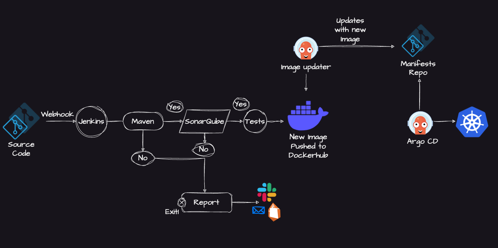

Absolutely! Here's a polished and clearer version of your README with better explanations and flow, while keeping all your key info and screenshots references intact:

---

# Java Application - CI/CD with Jenkins, SonarQube, Argo CD, Docker & Kubernetes



## Project Overview

This project demonstrates a complete **CI/CD pipeline** for a Java Spring Boot web application, leveraging modern DevOps tools:

- **Build Tool:** Maven
- **CI/CD Tool:** Jenkins
- **Code Quality:** SonarQube
- **Containerization:** Docker
- **Orchestration & Deployment:** Kubernetes & Helm charts
- **GitOps & Continuous Delivery:** Argo CD

## Key Features

- Automated build, test, and package using Maven.
- Static code analysis and quality checks using SonarQube.
- Docker image build and push to Docker Hub registry.
- Kubernetes manifests managed via Helm for consistent deployments.
- Automated deployment to Kubernetes through Argo CD GitOps workflows.
- Source code and pipeline definitions managed and version-controlled in GitHub.

---

## How Argo CD Fits Into the Workflow

Argo CD acts as a **continuous deployment operator** that watches your Git repository containing Kubernetes manifests or Helm charts. Whenever your Jenkins pipeline updates the deployment manifests with a new Docker image tag, Argo CD detects these changes and **automatically syncs** your Kubernetes cluster to reflect the new application version.

**Workflow Summary:**

- Jenkins builds, tests, and pushes the Docker image.
- Jenkins updates Kubernetes manifests (or Helm charts) with the new image tag and pushes these changes to GitHub.
- Argo CD monitors this Git repo and triggers deployment of the updated manifests to your Kubernetes cluster automatically.

This GitOps approach ensures your cluster state is **declarative, version-controlled, and automatically up-to-date** with your latest builds.

---

## Jenkins Pipeline Stages

The pipeline is defined in the included `Jenkinsfile` and performs the following steps:

1. **Clean Workspace**
   Remove old build artifacts to start fresh.

2. **Checkout Source Code**
   Clone the Java application's GitHub repository.

3. **Build and Test**
   Compile, package, and run unit tests using Maven.

4. **Static Code Analysis**
   Run SonarQube scans with credentials securely stored in Jenkins.

5. **Build and Push Docker Image**
   Build a Docker image tagged with the Jenkins build number and push it to Docker Hub.

6. **Update Deployment Manifest**
   Clone the Kubernetes manifests repository, update the Docker image tag in the deployment YAML, commit the change, and push it back to GitHub to trigger Argo CD.

---

## Prerequisites

- Java Development Kit (JDK) 11 or higher (JDK 17 recommended for SonarQube compatibility)
- Maven 3.6+
- Docker installed locally with access to Docker Hub account
- Jenkins server with plugins:

  - Git Plugin
  - Pipeline Plugin
  - Maven Integration Plugin
  - Kubernetes Continuous Deploy Plugin

- Kubernetes cluster with Helm installed
- SonarQube server accessible from Jenkins
- Argo CD installed and configured on your Kubernetes cluster

---

## Project Structure

```
java-app/
├── argo-cd/
│   └── argocd-basic.yml       # Argo CD Application manifest for pod deployment
├── docker-agent/
│   └── Dockerfile             # Dockerfile for Jenkins build agent image
├── images/                    # Screenshots of Jenkins, SonarQube, Argo CD dashboards
├── manifests/
│   └── deployment.yaml        # Kubernetes deployment YAML (updated automatically)
├── src/                       # Java application source code
├── target/                    # Maven build output (generated during build)
├── Dockerfile                 # Dockerfile to containerize the Java app
├── Jenkinsfile                # Jenkins pipeline configuration (Groovy DSL)
└── pom.xml                    # Maven project configuration file
```

---

## Screenshots

### Argo CD Dashboard


### Jenkins Pipeline


### SonarQube Code Analysis


---

## Getting Started

1. Clone this repository:

   ```bash
   git clone https://github.com/kishgi/java-app.git
   cd java-app
   ```

2. Configure Jenkins with appropriate credentials for SonarQube, Docker Hub, and GitHub.

3. Setup SonarQube and Argo CD servers accessible by Jenkins and your Kubernetes cluster.

4. Run the Jenkins pipeline job to automatically build, analyze, containerize, and deploy your app.

---

Questions? Reach out to [kishgi](mailto:kishgi1234@gmail.com).

---
